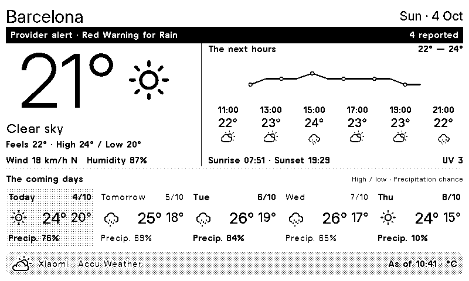

# Xiaomi Weather for TRMNL

Atmosphere is a TRMNL weather plugin with full, half and quadrant layouts for TRMNL OG and TRMNL X. The default location is Barcelona, Spain.

## Features

- Large current temperature and monochrome SVG weather icons
- Hourly temperature trend and five-day outlook
- Precipitation chances, wind, humidity, sun times and UV
- Celsius or Fahrenheit and configurable Xiaomi location keys
- Provider-reported alerts and clear unavailable or old-data states
- Dedicated layouts for all four mashup sizes

## Local development

Open `TRMNL/` with [TRMNLP](https://github.com/usetrmnl/trmnlp), configure the city and temperature unit in `.trmnlp.yml`, and preview all four layouts. Use a current TRMNLP release with JavaScript transform support.

See [the plugin README](TRMNL/README.md) for previews, setup, city lookup, data behavior and verification details.

## References

- [Xiaomi weather API reference](https://github.com/saving/China-Apps-Api/blob/master/XiaomiWeather.md)
- [TRMNL Private Plugins](https://help.trmnl.com/en/articles/9510536-private-plugins)
- [TRMNL weather recipes](https://trmnl.com/recipes?search=weather&sort-by=popularity)
- [TRMNL Framework](https://trmnl.com/framework)
- [Official TRMNL agent skill](https://github.com/usetrmnl/trmnl-agent-skills)
