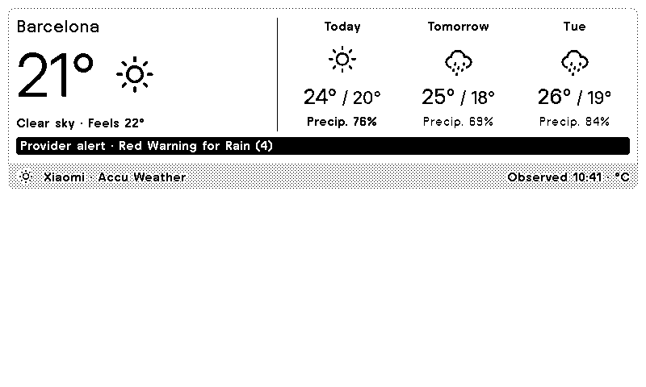
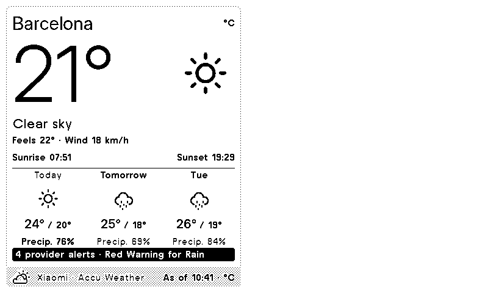
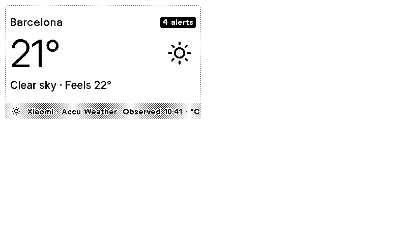
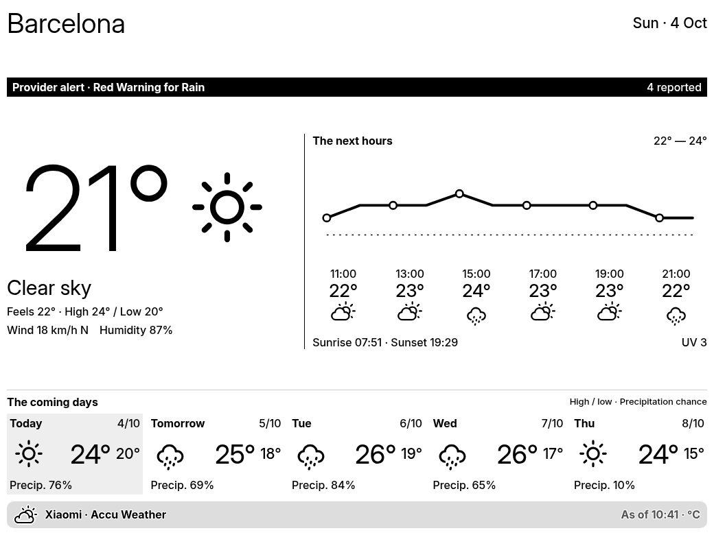
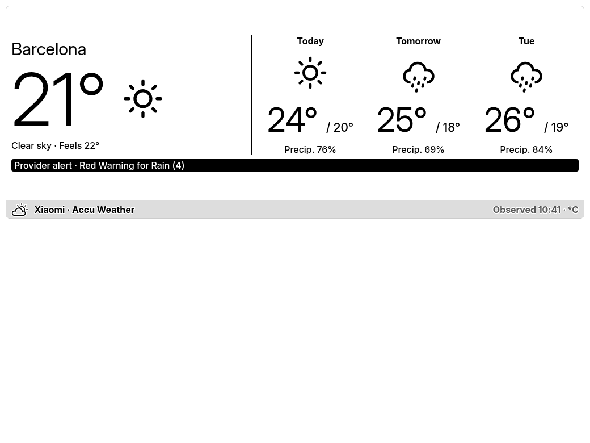
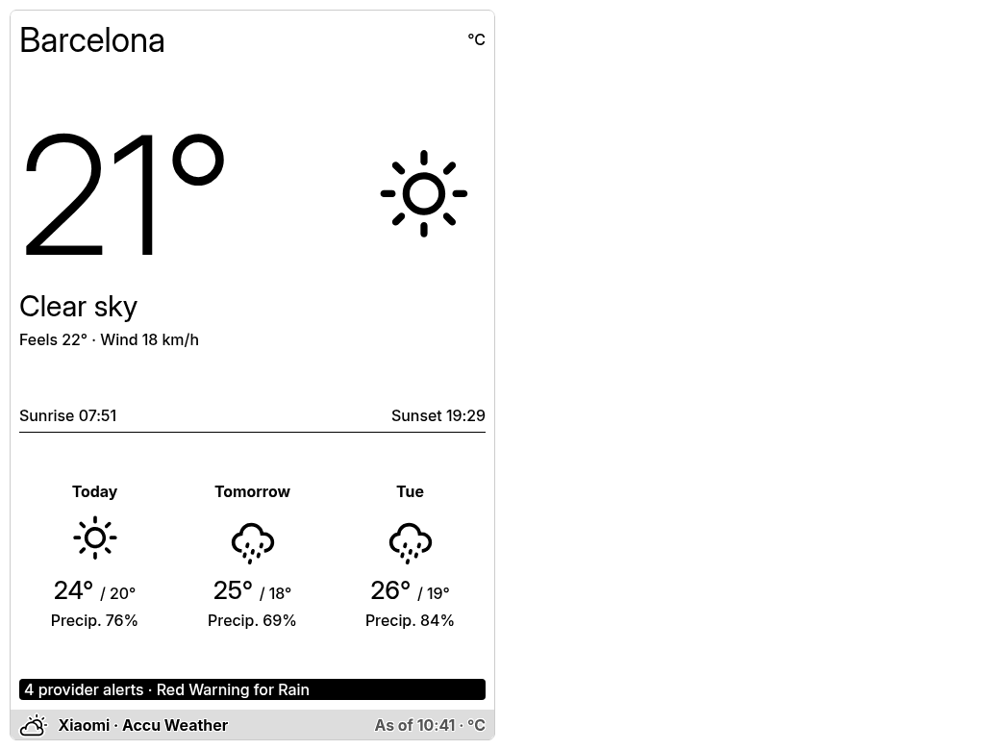
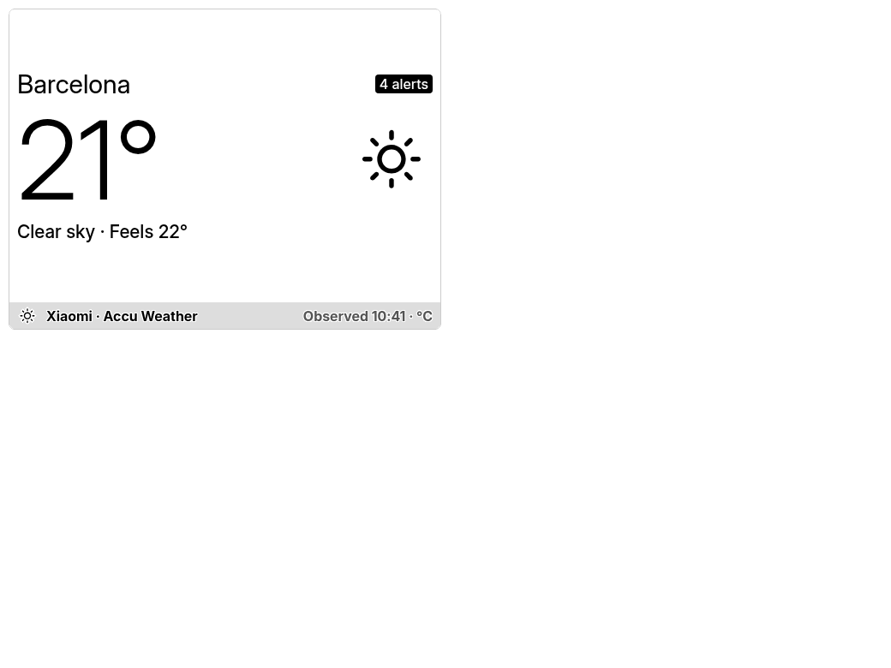

# TRMNL Xiaomi Weather Plugin

Atmosphere displays Xiaomi's current conditions and forecasts with native TRMNL typography and [TRMNL's official weather SVGs](https://help.trmnl.com/en/articles/11823386-weather-icons). Enter **Location**, such as `Barcelona, Spain`, or optional **Coordinates**, which take priority. Xiaomi's lookup supplies both the forecast key and the display name. No separate server or personal weather API key is required.

## Icon

The plugin icon is an unchanged copy of TRMNL's `wi-day-sunny.svg`, stored in the bundle and referenced from `settings.yml`. Display icons load from TRMNL's hosted pack, with clear and partly cloudy night variants and the official unavailable icon for unknown codes.

<div align="center">
  
</div>

## Previews

Previews use a recorded Barcelona response from **4 October 2026**, not a current forecast. OG images use a 1-bit palette; X images use 16 grayscale levels.

| Full View | Half Horizontal View |
|------------|----------------------|
|  |  |

| Half Vertical View | Quadrant View |
|-------------------|----------------|
|  |  |

| TRMNL X Full View | TRMNL X Half Horizontal |
|------------------|------------------------|
|  |  |

| TRMNL X Half Vertical | TRMNL X Quadrant |
|----------------------|-----------------|
|  |  |

## Setup

Create a TRMNL Private Plugin with Polling / GET, Framework **3.4.0**, screen padding enabled and a **30-minute** refresh interval. Private plugins require Developer or BYOD access.

Use [TRMNLP](https://github.com/usetrmnl/trmnlp) **0.16.0 or newer**, open this directory and run:

```sh
trmnlp serve
```

`.trmnlp.yml` contains the local custom-field values. The Node Serverless function runs automatically: polling resolves the coordinates or city name, then `run(input)` fetches its forecast. Once ready to upload, authenticate and push to your own plugin:

```sh
trmnlp login
trmnlp push --id YOUR_PLUGIN_SETTING_ID
```

Alternatively, copy `src/settings.yml` into the matching dashboard settings, paste `shared.liquid` into Shared and each layout into its matching markup tab, then paste the complete `transform.js` into **Serverless** and select **Node**. The entry point is the asynchronous `run(input)` function, which calls the formatting helper `transform`. Force Refresh, check the preview and add the plugin to your playlist. Existing installs should set the new Location field after updating; the separate display name and key fields have been removed.

The GitHub **Publish to TRMNL** workflow runs manually. Configure repository secrets `TRMNL_API_KEY` and `TRMNL_PLUGIN_SETTING_ID`, then run it from Actions. The setting ID is the number in `/plugin_settings/<ID>/edit`. Publishing the GitHub repository alone does not run this workflow.

## Templates

- **transform.js**: Validates optional coordinates, resolves the weather location, fetches its forecast, and converts Xiaomi's response into display-ready variables, official weather icon URLs and numeric chart coordinates.
- **shared.liquid**: Attribution, unavailable-data state, provider notices and hourly chart.
- **full.liquid**: Current conditions, hourly temperatures, five daily forecasts, wind, humidity, sun times and UV.
- **half_horizontal.liquid**: Current weather beside three daily forecasts and a provider notice.
- **half_vertical.liquid**: Large current temperature, sun times, three daily forecasts and a provider notice.
- **quadrant.liquid**: Current temperature, condition, feels-like temperature and alert count.

All four layouts use Framework 3.4.0 utilities without custom CSS. Their OG areas are 800 × 480, 800 × 240, 400 × 480 and 400 × 240; X uses the corresponding portions of 1040 × 780. Platform margins and title bars reduce the usable content area.

## Choose a city

**Coordinates take priority over Location.** Enter decimal degrees in **latitude, longitude** order, for example `48.8584,2.2945`. Find a place on [latlong.net](https://www.latlong.net/) and copy its Latitude and Longitude values into this field, separated by a comma. Negative values represent south/west; latitude must be between −90 and 90, and longitude between −180 and 180.

With Coordinates filled, Location is ignored for lookup and display. Xiaomi supplies the nearest supported locality and its name, which may be a district rather than a whole city. Your Barcelona example resolves to **Muette**. The forecast request includes the supplied coordinates and the resolved key. No key needs to be entered manually.

Invalid or unresolved coordinates display an error; they do not silently fall back to a different city's forecast. Leave Coordinates empty to use **Location**, a full city name followed by its country. Add a region when multiple cities share that name. Location defaults to `Barcelona, Spain`; `temperature_unit` accepts `celsius` or `fahrenheit`.

| Location example | Display name |
|------------------|--------------|
| `Barcelona, Spain` | Barcelona |
| `Paris, France` | Paris |
| `Amsterdam, Netherlands` | Amsterdam |
| `New York, New York, United States` | New York |

Use the city spelling returned by Xiaomi. Country and region qualifiers match the returned affiliation names, ignoring case and accent differences. A city name alone is accepted only when it resolves uniquely. The plugin never selects the first namesake automatically: ambiguous or missing matches display instructions to refine Location, without fetching another city's weather.

Use full names rather than airport codes or abbreviations such as `BCN` or `NY`; Xiaomi returned no matches for those searches. To inspect spelling or region names, open [Xiaomi city search](https://weatherapi.market.xiaomi.com/wtr-v3/location/city/search?name=Barcelona&locale=en_us) and replace `name` in the URL. Its `name` and `affiliation` values are the human-readable city and region/country names you can enter. You do not need to copy its location key.

The [TRMNL Node Serverless runtime](https://help.trmnl.com/en/articles/14130649-serverless) supports network requests. Polling uses Xiaomi's `/location/city/geo` endpoint when Coordinates is filled and `/location/city/search` otherwise, supplying the results under `data`. The function fetches the forecast using the resolved key, including Xiaomi's public client parameters from the [API reference](https://github.com/saving/China-Apps-Api/blob/master/XiaomiWeather.md). The forecast request has a 3.5-second timeout within TRMNL's five-second execution budget. API failures produce an unavailable state and retry on the next refresh.

## Data behavior

- Xiaomi supplied five daily forecasts and 23 hourly entries for Barcelona despite a seven-day request. The plugin shows returned data only, sampling up to six points across the next 12 hours.
- The observation time remains visible. Observations older than three hours are marked as old data when rendered; elapsed hourly entries are removed.
- Missing optional values display an em dash. Missing current temperature produces an explicit unavailable state. Missing precipitation is never reported as 0%.
- European air-quality fields were unavailable and are omitted. Attribution follows the returned provider, AccuWeather via Xiaomi in the tested cities.
- Alerts are **provider-reported** titles/counts. Xiaomi supplied no structured expiration fields, so the plugin does not determine whether a warning is still in effect. Consult the provider for details.
- Local times preserve the API's UTC offset and hourly wind timestamps when supplied. Without those timestamps, a forecast crossing a DST transition may need a subsequent refresh for corrected hour labels.
- Condition codes follow the network API's [weather-code table](https://github.com/JoinChen/Api/blob/master/xiaomi_weather_status.json). Xiaomi's Android content-provider code table describes a different interface.

## Verification and references

Both name and coordinate lookup succeeded live around Barcelona, Paris and Amsterdam. Checks covered coordinate priority over a conflicting name, blank-coordinate fallback, zero/negative/boundary values, invalid coordinate rejection, country/region disambiguation, duplicate results, missing cities, invalid keys, forecast errors and timeouts; uncertain locations made no forecast request. Transform checks also covered missing and zero weather values, partial forecasts, old observations, local timestamps, night icons and Fahrenheit. All four Liquid templates compiled against real responses and unavailable data. Chromium renders with the pinned official framework fitted all eight OG/X areas; long locality names, coordinate errors and ambiguous names were also checked. The committed WebP previews preserve the verified e-ink palettes losslessly.

The local rendering checks used LiquidJS. Account-side import, scheduled refresh and a physical e-ink panel remain unverified.

Design research included [Weather Glance](https://trmnl.com/recipes/181200), the [Extended Weather Dashboard](https://github.com/Baszert/trmnl-extended-weather-dashboard), TRMNL's [native weather fixture](https://github.com/usetrmnl/trmnl-framework/blob/main/public/framework/example_fixtures/weather/full.html), and the [official TRMNL agent skill](https://github.com/usetrmnl/trmnl-agent-skills). Reference application source was not copied.

The official skill can be used directly from its upstream repository. Optional MCP access uses `https://trmnl.com/mcp` with OAuth, or a plugin MCP key from its MCP tab. The account REST API key is not an MCP key. No MCP credentials are stored in this project.
