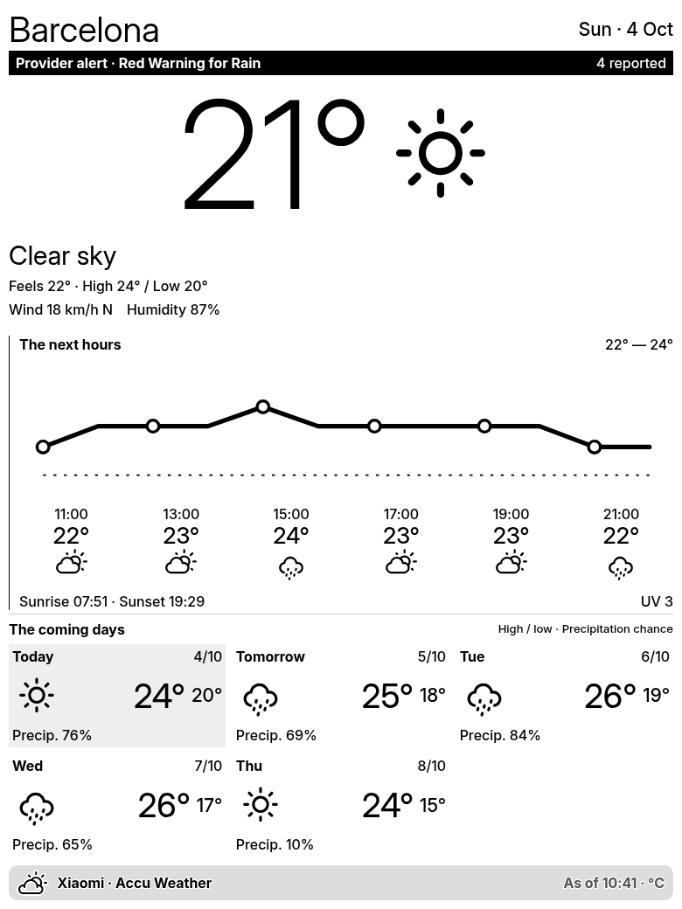
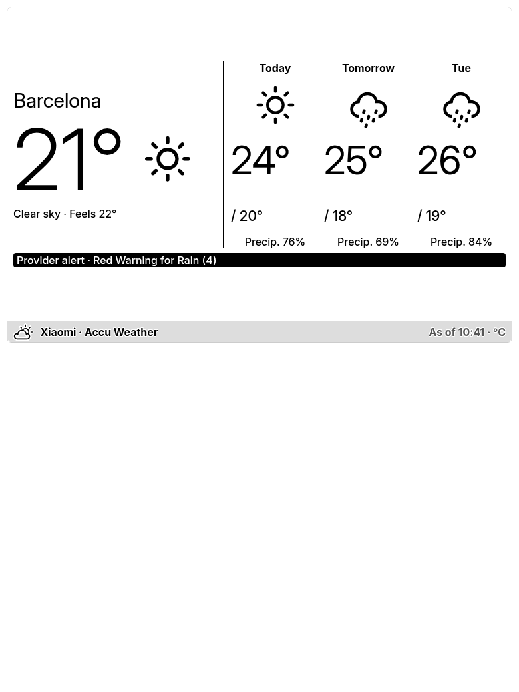
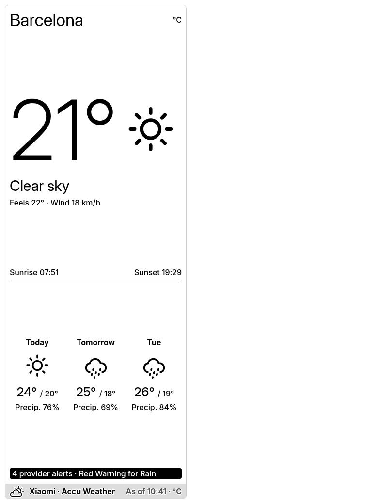
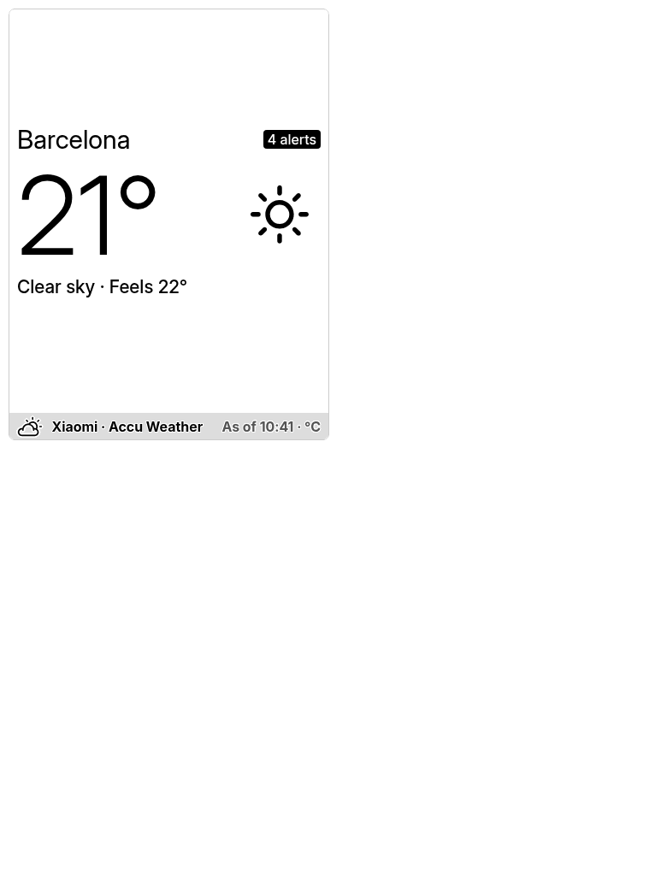

# TRMNL Xiaomi Weather Plugin

Xiaomi Weather displays current conditions and forecasts with native TRMNL typography and [TRMNL's official weather SVGs](https://help.trmnl.com/en/articles/11823386-weather-icons). Enter **Location**, such as `Barcelona, Spain`, or optional **Coordinates**, which take priority. Coordinates fetch a forecast directly in one request, using Location as the display label. Without Coordinates, Xiaomi's city search supplies the forecast key and canonical display name. No separate server or personal weather API key is required.

## Icon

The plugin listing icon uses the supplied sun-and-cloud artwork, simplified to one path and centered on a square 512 × 512 canvas with a small side margin in TRMNL orange (`#E76F55`), stored in the bundle and referenced from `settings.yml`. Each layout's title bar embeds the same artwork in black (`#000000`). Weather condition icons load from TRMNL's hosted pack, with clear and partly cloudy night variants and the official unavailable icon for unknown codes.

<div align="center">
  
</div>

## Previews

Previews use a recorded Barcelona response from **4 October 2026**, not a current forecast. OG images use a 1-bit palette; X images use 16 grayscale levels.

| Full View | Half Horizontal View |
|------------|----------------------|
|  |  |

| Half Vertical View | Quadrant View |
|-------------------|----------------|
|  |  |

| TRMNL X Full View | TRMNL X Half Horizontal |
|------------------|------------------------|
|  |  |

| TRMNL X Half Vertical | TRMNL X Quadrant |
|----------------------|-----------------|
|  |  |

| TRMNL X Portrait Full | TRMNL X Portrait Half Horizontal |
|----------------------|---------------------------------|
|  |  |

| TRMNL X Portrait Half Vertical | TRMNL X Portrait Quadrant |
|--------------------------------|--------------------------|
|  |  |

## Setup

Create a TRMNL Private Plugin with Polling / GET, Framework **3.4.0**, screen padding enabled and a **30-minute** refresh interval. Private plugins require Developer or BYOD access.

Use [TRMNLP](https://github.com/usetrmnl/trmnlp) **0.16.0 or newer**, open this directory and run:

```sh
trmnlp serve
```

`.trmnlp.yml` contains the local custom-field values. The Node Serverless function runs automatically: native polling fetches the forecast directly when Coordinates is filled. Otherwise polling searches by city name, then `run(input)` fetches its forecast. Once ready to upload, authenticate and push to your own plugin:

```sh
trmnlp login
trmnlp push --id YOUR_PLUGIN_SETTING_ID
```

With a scoped `trmnl_...` account key, interactive `trmnlp login` needs **Profile** access and uploading needs **Content** access. **Read** is needed only for commands such as `list` and `pull`. CI supplies the key through `TRMNL_API_KEY` instead of logging in, so it can use a Content-only key restricted to this plugin.

Alternatively, copy `src/settings.yml` into the matching dashboard settings, paste `shared.liquid` into Shared and each layout into its matching markup tab, then paste the complete `transform.js` into **Serverless** and select **Node**. The entry point is the asynchronous `run(input)` function, which calls the formatting helper `transform`. Force Refresh, check the preview and add the plugin to your playlist. Existing installs should set the new Location field after updating; the separate display name and key fields have been removed.

The GitHub **Publish to TRMNL** workflow runs when changes to `TRMNL/src/`, `TRMNL/media/` or the workflow file are pushed to `main`. You can also run it manually from Actions. To configure it:

1. Open [Account > Developer](https://trmnl.com/account/developer/edit) and create an **Account API key**, such as `Xiaomi Weather GitHub Actions`.
2. Enable **Content** only. Under Access control, choose **Only specific devices and plugin settings** and grant access to this weather plugin setting. The workflow updates an existing plugin; it does not need Profile, Read, Devices, Delete or Apps permissions.
3. Copy the new `trmnl_...` key into the repository's [Actions secrets](https://github.com/taichikuji/trmnl-xiaomi-weather-plugin/settings/secrets/actions) as `TRMNL_API_KEY`. Replace the old secret if it exists; do not include `Bearer` in the secret value.
4. Set `TRMNL_PLUGIN_SETTING_ID` to the number in your plugin's `/plugin_settings/<ID>/edit` URL. This is the installed plugin setting ID, not a recipe or device ID.
5. Run **Publish to TRMNL** once to verify access. Subsequent pushes to `main` publish automatically when the relevant files change.

The workflow uses the official `trmnl/trmnlp:v0.16.0` image and passes the key through `TRMNL_API_KEY`; TRMNLP adds the Bearer header. No CI login step or separate OAuth flow is needed. A missing capability or plugin access produces a TRMNL 403: recreate the key for a missing capability, or edit its access for a missing plugin grant. See [Account API Keys](https://help.trmnl.com/en/articles/11195228-account-api-keys) and [TRMNLP authentication](https://github.com/usetrmnl/trmnlp#authentication).

## Templates

- **transform.js**: Validates optional coordinates, fetches a forecast only for city-name searches, and converts Xiaomi's response into display-ready variables, official weather icon URLs and numeric chart coordinates.
- **shared.liquid**: Attribution, unavailable-data state, provider notices and hourly chart.
- **full.liquid**: Current conditions, hourly temperatures, five daily forecasts, wind, humidity, sun times and UV.
- **half_horizontal.liquid**: Current weather beside three daily forecasts and a provider notice.
- **half_vertical.liquid**: Large current temperature, sun times, three daily forecasts and a provider notice.
- **quadrant.liquid**: Current temperature, condition, feels-like temperature and alert count.

All four layouts use Framework 3.4.0 utilities without custom CSS. Their OG areas are 800 × 480, 800 × 240, 400 × 480 and 400 × 240; X uses the corresponding portions of 1040 × 780, or 780 × 1040 in portrait. The full portrait view stacks current conditions and hourly weather, with three columns for the daily forecasts. Platform margins and title bars reduce the usable content area.

## Public recipe submission

Reviewed against [TRMNL's publishing best practices](https://trmnl.com/blog/plugin-recipe-publishing-tips):

- Xiaomi provides a distinct data source; all four layouts ship in one recipe.
- The About section links to setup instructions and the GitHub repository for support, with the environment category. Settings contain no personal defaults or weather credentials.
- Polling handles coordinate forecasts directly; city-name lookup uses a bounded Serverless request. Markup uses native Framework classes and Liquid, a shared embedded title-bar icon, and an SVG chart without chart libraries or client-side API calls.
- Chromium checks covered all four views on OG landscape, X landscape and X portrait, including Fahrenheit, long names, stale observations and unavailable forecasts. Narrow title bars retain attribution, observation time and unit.

Before submitting in TRMNL, save and Force Refresh with a public demo city such as `Barcelona, Spain`, leaving Coordinates blank. Confirm that the install preview shows the city rather than a personal label, and save both location methods and temperature units once to check the account-side form behavior. Run CHEF and address any feedback before acknowledging the practices. Keep the Recipe Master configured for public demo weather and install a separate copy for personal use. These account-side steps and the human review are not confirmed by a successful GitHub upload.

The original design, parsing logic and markup are also available under **CC BY 4.0** in [LICENSE](../LICENSE), matching [TRMNL's public plugin license](https://trmnl.com/plugin-license). Support is available through the About section's GitHub issue link.

CHEF may flag these intentional choices:

- **Title bar include:** every layout outputs `weather_footer`, captured in `shared.liquid`. It contains the [standard native title bar](https://trmnl.com/framework/docs/3.4/title_bar), including our icon, provider attribution, observation time and unit; a separate render include is unnecessary.
- **Image dithering:** all display images are monochrome SVG icons. [TRMNL documents `image-dither` for raster images](https://trmnl.com/framework/docs/3.4/image); no photos or color raster images need conversion here.
- **Serverless fetch:** the city-name forecast URL requires the key returned by that refresh's city lookup. [Polling URL markup is rendered before requests start](https://help.trmnl.com/en/articles/12689499-dynamic-polling-urls), so adding a second URL cannot resolve that dependency. Only this forecast request runs in Serverless, with a 3.5-second abort covering the response body and a clear unavailable state on failure. Coordinates avoid the Serverless request entirely. A slow Xiaomi response can still cause a city-name refresh to fail; use Coordinates for native polling.

## Choose a city

**Coordinates take priority over Location.** Enter decimal degrees in **latitude, longitude** order, for example `48.8584,2.2945`. Find a place on [latlong.net](https://www.latlong.net/) and copy its Latitude and Longitude values into this field, separated by a comma. Negative values represent south/west; latitude must be between −90 and 90, and longitude between −180 and 180.

With Coordinates filled, TRMNL polls Xiaomi's forecast endpoint directly with those coordinates, without a location key or a separate lookup request. Location supplies the display label (the part before the first comma), so use `Barcelona` for your example. A blank Location displays the neutral title **Weather**. This label does not affect the forecast location: the returned provider URL identifies **Muette**. The forecast response has no separate city-name field.

Invalid coordinates or a missing forecast display an error; they do not silently fall back to a city-name forecast. Leave Coordinates empty to use **Location**, a city name with an optional country or region. Location starts empty and stays empty when cleared; Barcelona is only a placeholder example. The settings form requires **Location or Coordinates**: TRMNL's [conditional field validation](https://help.trmnl.com/en/articles/10513740-custom-plugin-form-builder) makes Coordinates required when Location is blank. The Serverless guard also rejects both fields being empty. Temperature unit is required, defaults to Celsius, and accepts `celsius` or `fahrenheit`.

| Location example | Display name |
|------------------|--------------|
| `Barcelona` | Barcelona |
| `Barcelona, Spain` | Barcelona |
| `Paris, France` | Paris |
| `Amsterdam, Netherlands` | Amsterdam |
| `New York, New York, United States` | New York |

The plugin uses Xiaomi's first successful result, preserving its search order and displaying the returned name. For `Barcelona`, the supplied search results put Spain first. This order does not guarantee your intended country: if the forecast is for the wrong place, add a country or region, such as `Barcelona, Venezuela`, or use Coordinates. Country and region qualifiers match the returned affiliation names, ignoring case and accent differences; the first result satisfying them is used. Missing matches display instructions to refine Location without fetching a forecast.

Use full names rather than airport codes or abbreviations such as `BCN` or `NY`; Xiaomi returned no matches for those searches. To inspect spelling or region names, open [Xiaomi city search](https://weatherapi.market.xiaomi.com/wtr-v3/location/city/search?name=Barcelona&locale=en_us) and replace `name` in the URL. Its `name` and `affiliation` values are the human-readable city and region/country names you can enter. You do not need to copy its location key.

The [TRMNL Node Serverless runtime](https://help.trmnl.com/en/articles/14130649-serverless) supports network requests. [Native dynamic polling](https://help.trmnl.com/en/articles/12689499-dynamic-polling-urls) uses Xiaomi's `/weather/all` endpoint when Coordinates is filled: one request, with no Serverless fetch. Otherwise it polls `/location/city/search`, supplying the results under `data`, and the function fetches the forecast using the resolved key. Both forecast paths include Xiaomi's public client parameters from the [API reference](https://github.com/saving/China-Apps-Api/blob/master/XiaomiWeather.md). Only the city-name path makes a Serverless network request, with a 3.5-second timeout within TRMNL's five-second execution budget. API failures produce an unavailable state and retry on the next refresh.

## Data behavior

- Xiaomi supplied five daily forecasts and 23 hourly entries for Barcelona despite a seven-day request. The plugin shows returned data only, sampling up to six points across the next 12 hours.
- The observation time remains visible. Observations older than three hours are marked as old data when rendered; elapsed hourly entries are removed.
- Missing optional values display an em dash. Missing current temperature produces an explicit unavailable state. Missing precipitation is never reported as 0%.
- European air-quality fields were unavailable and are omitted. Attribution follows the returned provider, AccuWeather via Xiaomi in the tested cities.
- Alerts are **provider-reported** titles/counts. Xiaomi supplied no structured expiration fields, so the plugin does not determine whether a warning is still in effect. Consult the provider for details.
- Local times preserve the API's UTC offset and hourly wind timestamps when supplied. Without those timestamps, a forecast crossing a DST transition may need a subsequent refresh for corrected hour labels.
- Condition codes follow the network API's [weather-code table](https://github.com/JoinChen/Api/blob/master/xiaomi_weather_status.json). Xiaomi's Android content-provider code table describes a different interface.

## Verification and references

Run the dependency-free location check from this directory:

```sh
node check.cjs
```

It checks provider ordering, optional country/region qualifiers, canonical city-search names, direct coordinate forecasts without an additional fetch, Location display labels, Fahrenheit conversion and rejection of invalid or unmatched inputs.

City searches and direct coordinate forecasts succeeded live around Barcelona, Paris and Amsterdam. The coordinate-only Barcelona response identified the same provider locality and returned the same current, daily and hourly weather as the request with its resolved key. Checks covered coordinate priority over a conflicting name, blank-coordinate fallback, zero/negative/boundary values, invalid coordinate rejection, country/region disambiguation, duplicate results, missing cities, invalid keys, forecast errors and timeouts; invalid or unmatched city searches made no forecast request. Invalid coordinates are rejected before displaying the polling response. Transform checks also covered missing and zero weather values, partial forecasts, old observations, local timestamps, night icons and Fahrenheit. All four Liquid templates compiled against real responses and unavailable data. Fresh Chromium verification covered 72 renders: all four views on OG landscape, X landscape and X portrait, each with Celsius, Fahrenheit, a long location name, stale data, missing forecasts and unavailable data. Content and title-bar text fit their areas. The committed WebP previews preserve the verified e-ink palettes losslessly.

The local rendering checks used LiquidJS. Account-side form validation, scheduled refresh and a physical e-ink panel remain unverified.

Design research included [Weather Glance](https://trmnl.com/recipes/181200), the [Extended Weather Dashboard](https://github.com/Baszert/trmnl-extended-weather-dashboard), TRMNL's [native weather fixture](https://github.com/usetrmnl/trmnl-framework/blob/main/public/framework/example_fixtures/weather/full.html), and the [official TRMNL agent skill](https://github.com/usetrmnl/trmnl-agent-skills). Reference application source was not copied.

The official skill can be used directly from its upstream repository. Optional MCP access uses `https://trmnl.com/mcp` with OAuth, or a plugin MCP key from its MCP tab. The account REST API key is not an MCP key. No MCP credentials are stored in this project.
